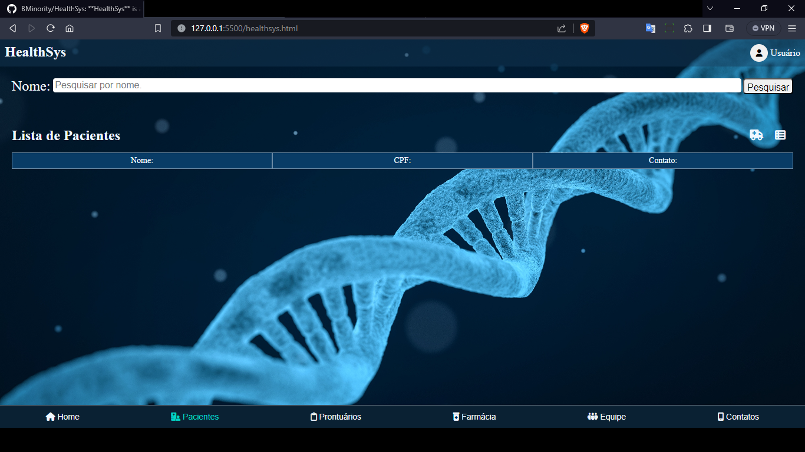

# HealthSys

O HealthSys é um sistema desenvolvido para auxiliar clínicas e hospitais no gerenciamento do atendimento de seus pacientes, controle de estoque de medicamentos, histórico de entrada e saída de medicamentos, controle de receituário e outras funcionalidades relacionadas. Este repositório contém os arquivos e o código-fonte necessários para executar o sistema.

## Demonstração
- Login: admin
- Senha: admin

[HealthSys](https://bminority.github.io/HealthSys/)


## Funcionalidades

O HealthSys oferece as seguintes funcionalidades:

- Gerenciamento de pacientes: controle de entrada e saída de pacientes, histórico de atendimentos e alocação em diferentes alas do hospital.
- Controle de estoque de medicamentos: registro de medicamentos disponíveis, níveis de estoque, histórico de entrada e saída de medicamentos.
- Controle de receituário: registro e gerenciamento de receitas médicas, com associação aos pacientes e medicamentos prescritos.
- Outras funcionalidades adicionais, como relatórios, estatísticas e configurações do sistema.

## Tecnologias utilizadas

O HealthSys foi desenvolvido utilizando as seguintes tecnologias:

- HTML: para estruturar as páginas do sistema.
- CSS: para estilizar as páginas e melhorar a aparência visual.
- JavaScript: para adicionar interatividade e funcionalidades ao sistema web.

## Instalação e Execução

Para executar o HealthSys localmente, siga as instruções abaixo:

1. Clone este repositório em sua máquina local:

   ```bash
   git clone https://github.com/BMinority/HealthSys.git
   ```

2. Navegue até o diretório do projeto:

   ```bash
   cd HealthSys
   ```

3. Abra o arquivo `index.html` em seu navegador preferido.

   O sistema será carregado e você poderá interagir com suas funcionalidades.

## Layout




   

## Limitações

O HealthSys ainda está em desenvolvimento e algumas funcionalidades podem estar incompletas ou não implementadas. Além disso, este repositório é apenas para fins de análise e não deve ser utilizado para outros fins sem a devida autorização.

## Contato

Caso você tenha alguma dúvida ou precise entrar em contato com o desenvolvedor deste sistema, utilize as informações abaixo:

Bruno Coelho Muniz Silva
- Email: brunocoelho66@gmail.com
- Telefone/whatsapp: (81) 9 8920-6365
[Linkedin](www.linkedin.com/in/dev-bcoelho)
